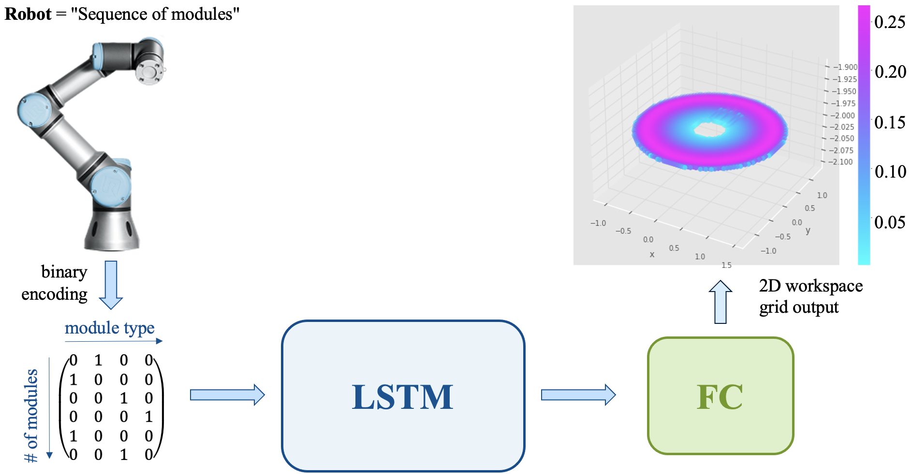

# Project IDENT: Supervised Learning for Robot Workspace Identification
The problem of accurately and efficiently describing a robot’s workspace is of high importance for a range of tasks 
like motion planning and control. This problem becomes more complicated in the field of modular robotics specifically, 
due to the flexibly changeable characteristics of the manipulator. With traditional methods being infeasible for these 
types of robots, we develop a novel, generic framework for workspace identification based on the supervised training of 
a neural network. We apply our method to the setting of robot movements restricted to a 2D plane and distinguish two 
prediction tasks for binary reachability and dexterity in the form of a manipulability index. Results demonstrate the 
effectiveness of our approach and indicate the generation of highly precise workspaces especially for modular robots 
with higher degrees of freedom.

## Overview
This repository was created as part of a project of the practical course "Praktikum - Reinforcement and Feature Learning / Motion Planning and Control for Robotic Manipulators".

**Project name:** Supervised Learning for Robot Workspace Identification (IDENT)\
**Students:** Lukas Hornik, Xinyu Chen, Theresa Bruns\
**Advisor:** Jonathan Külz\
**Supervisor:** Prof. Dr.-Ing. Matthias Althoff\
**Submission:** 11. August 2023

**Note:** files in archive folders were used during the project, but might not work anymore due to other changes

### Important Files:
- `/data_generation/data_generation_pipeline_mp.py` (used to generate the 1 million dataset)
- `/data_generation/RobotsGen/robot_gen_random` (used to generate the robots)
- `/data/*` (includes the datasets)
- `/data/robots_mio/robots_mio` (1 million dataset, **HINT**: most file explorer can't handle opening robots_mio folder; if using PyCharm mark this folder as "Excluded")
- `/data/robots_mio_subset/*` (includes the 2k and 100k set)
- `/Studies/*` (includes study results for FK sampling in 2D and the data of the table used in the product presentation)
- `/evaluation/*` (includes files used to generate the evaluation part of the report)
- `/train_optuna.py` (used for finding hyperparameter with Optuna)
- `/train_final.py` (used for generating final model)
- `/train.py` (base script for train_optuna.py and train_final, which contains dummy test on IMDB dataset and intial overfitting test on the model of current work with single sample and 20 training samples)

# Installation:
1. Clone repository
2. Get the current version of the timor-python library using pip
3. Install timor-python as submodule
4. Create anaconda environment from `/environment.yml`

Following steps are needed for training with 1 million dataset (**HINT**: do steps 2. & 3.  ideally within the terminal, since most file explorer can not handle this many small files):
1. Download 1 million dataset from LRZ Sync&Share: https://syncandshare.lrz.de/getlink/fiEiWEhodVcWu8EnjpwUsd/1000000_data_01_07_2023.tar.gz (~6.1GB, Link expires at 01.01.2024)
2. Extract Zip file into `/data/robots_mio/` (~25GB)
3. Rename extracted folder to "robots_mio" to obtain following file structure: `/data/robots_mio/robots_mio/*`
